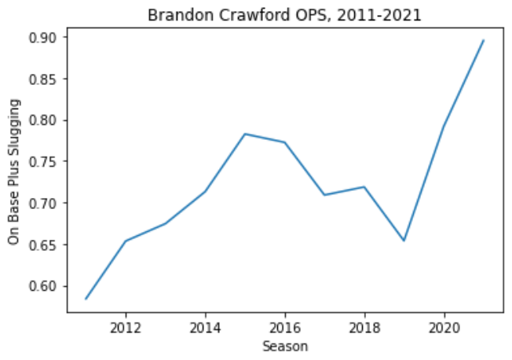

# baseballstats

<h1>Baseball Statistics</h1>
An analysis on the last 150 years of Major League Baseball and the impact that slugging and hitting percentages of batters are in terms of Sabermetrics and other sports statistics.

 

The following statistics in the Jupyter notebook titled Slugging.ipynb are: On-Base Percentage (OBP), Slugging Percentage (SLG), and On-base Plus Slugging (OPS) Percentage.

 

Over the course of time, this repository will contain code regarding prediction models, statistical analysis, player profiles, and data visualization of certain key components of Sabermetrics.

 

[Buster Posey](https://www.mlb.com/player/buster-posey-457763), former catcher of the San Francisco Giants (2009-2019, 2021), has been used in examples of data visualization. A three-time World Series Champion, seven-time All-Star and five-time Silver Slugger, some of his statistics have been and will be used as part of a small sample of one of the greatest catchers of all time. 

 

[Brandon Crawford](https://www.mlb.com/player/brandon-crawford-543063), shortstop of the San Francisco Giants, has been used as an example of the slugging statistics as well as data visualization that used in Sabermetrics, Gold Glove and All-Star selections as a two-time World Series Champion. Below is data showing his on-base plus slugging percentage in his current twelve-year career with the Giants:

 

[Hunter Pence](https://www.mlb.com/player/hunter-pence-452254), 14-year MLB veteran right fielder, has also been used as an example of the slugging statistics that are used in individual Sabermetrics examples, also a two-time World Series Champion. 

 

Inspired by the repository [Basics of Sabermetrics](https://github.com/rberns28/Basics-of-Sabermetrics) by [Ryan Berns](https://github.com/rberns28). 

 

A forked repository from Berns inspired the creation of this repo, which can be found [here](https://github.com/matthewjchin/Basics-of-Sabermetrics).

 

Potential Future Projects:

Predict the stats of players in 2020 season based on data from 2015-2019, had the 2020 season been a full 162-game season. 

Determining if higher OBP (not OPS) was result of the MVP finalists as they were

 

<b>Resources:</b>
 
Any 2021 statistics in these files for the repository have come from [Baseball Reference](https://www.baseball-reference.com/).

References used to both current and former players in this README have been taken from the [official website of Major League Baseball](https://www.mlb.com/).

Additionally, statistics from 1871 to 2020 used across this repository come from the [Baseball Databank](https://github.com/chadwickbureau/baseballdatabank), a resource of historical baseball data provided by the [Chadwick Baseball Bureau](http://www.chadwick-bureau.com/). Their repository of data can be found [here](https://github.com/chadwickbureau).

